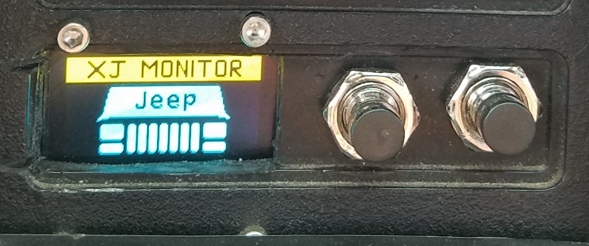
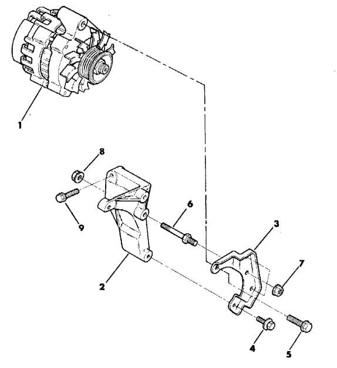
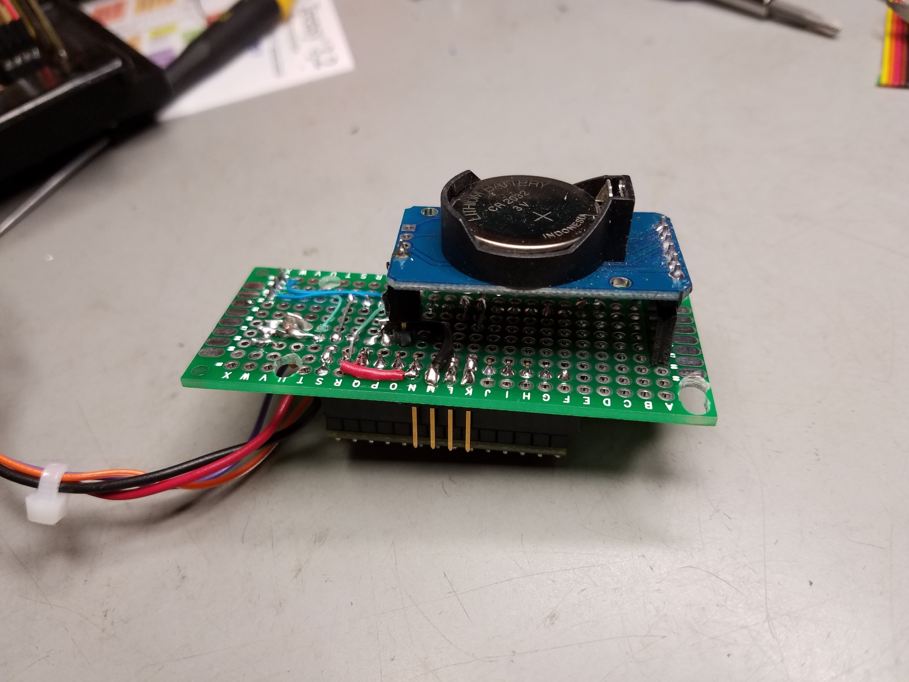
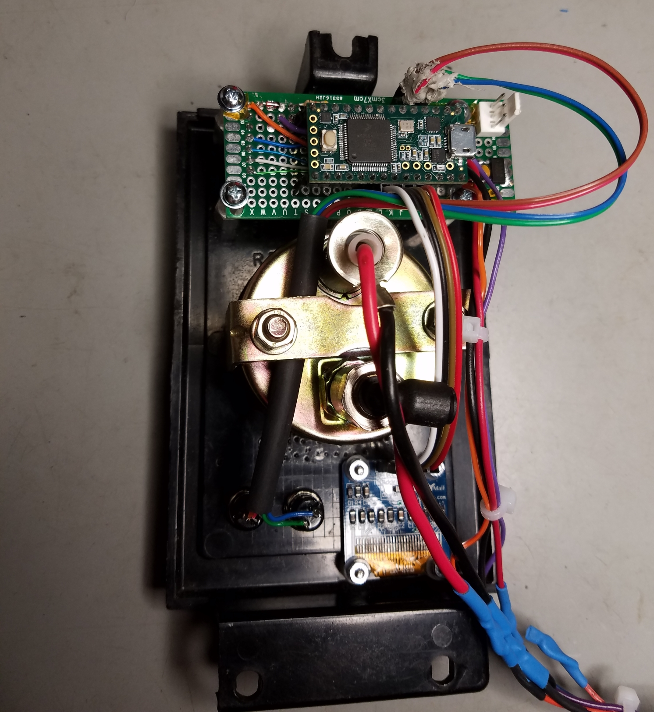
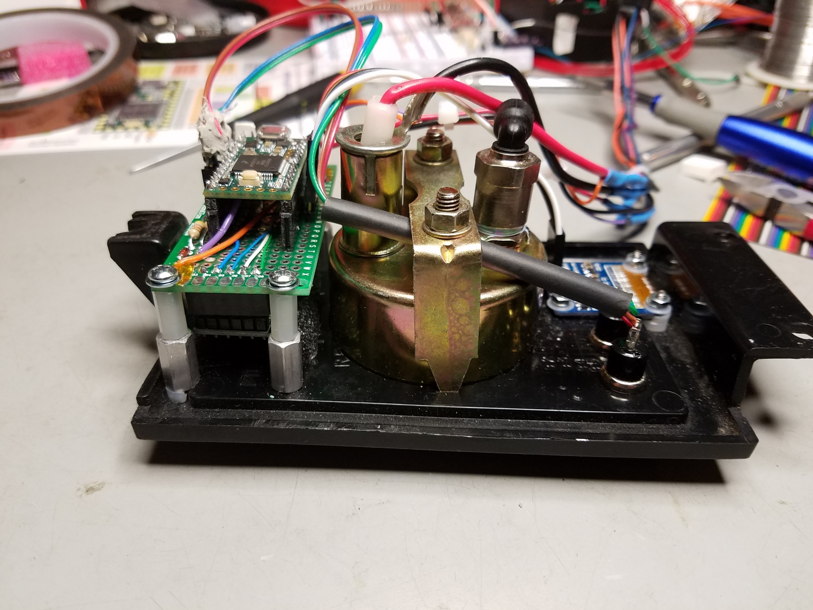
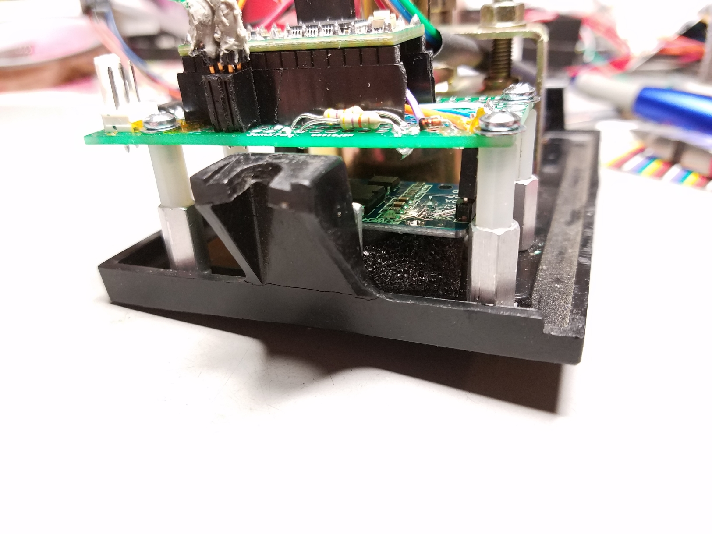
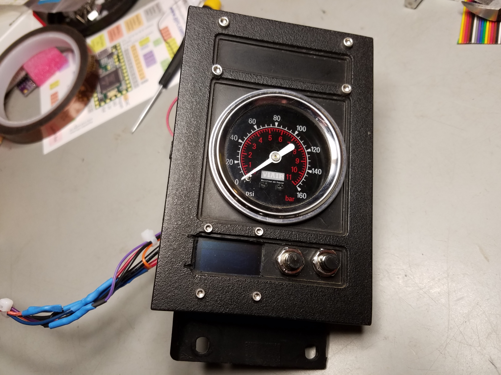

This page is a work in progress. I'll be adding more detail as I find the time.

# XJ-Monitor

This project is a two Arduino control system. One Arduino Nano in the engine bay to control the DR44 alternator, and get temperature. The other (Arduino compatible) Teensy 3.2 is in the dash to drive the OLED display and provide a two button user input for option selection. Both microcontrollers talk to each other via serial communication. The dash device is the master and sends requests to the (slave) engine bay device. 

Check out this YouTube video.

The Teensy and the 0.96" OLED are mounted in my 89 Jeep Cherokee XJ to give me ability to adjust my DR44 alternator output. Also displays Voltage, Time, Date, and Temp. The OLED display was mounted in a flat empty panel in my 89 XJ along with two push button switches used to navigate through the menu system. I started out with a Nano for the display, but the program quickly grew too big for the Nano's limited RAM space.

I'm using an Arduino Nano to drive the Alternator and get air temp. Future additions can be to get water temp from thermostat housing, relay fan control, DRL/halo/angel eye control - turn off the DRL when the turn signal is on. 

Want to control a DR44 without a display/GUI, see my other project - [DRuino44](https://github.com/sparcules/DRuino44) for more info.

## The Alternator Arduino
First the alternator itself...  My 89 Renix XJ had a very low mounted CS130 alternator on the passengers side. It died half way home from a day of offroading - I think mud worked it's way into the brushes. I thought that was a good time to upgrade and also mount the alternator in a higher (safer) spot in the engine bay. At the same time, I decided to ditch the old A/C compressor for a York 210 compressor.  I also ditched the Renix era A/C compressor bracket for a newer HO A/C compressor bracket. The Renix bracket has two horizontal bolts securing the compressor. The HO uses four verticle bolts. So it was easier (for me) to make the York bracket using the HO A/C bracket. 

The 160 Amp DR44 alternator can be found in one of the GMC trucks listed below. The first on the list being the Cadillac Escalade. It sounds cool, so I just tell everyone I upgrated to the Escalade alternator. The GMC trucks listed should all have the same mounting ears as the CS130 stock alternator. 

**Sources for DR44 / DR44G with mounting tabs good for Renix Cherokee**

|     GMC Model             |   Year     |
| ---------------------     | ---------- |
| CADILLAC ESCALADE  		    | 2007-2014  | 
| CHEVROLET AVALANCHE 		  | 2007-2013  | 
| CHEVROLET SILVERADO 1500 	| 2007-2013  | 
| CHEVROLET SILVERADO 2500	| 2007-2014  | 
| CHEVROLET SILVERADO 3500	| 2007-2014  | 
| CHEVROLET SUBURBAN 1500	  | 2007-2014  | 
| CHEVROLET SUBURBAN 2500	  | 2007-2013  | 
| CHEVROLET TAHOE		      	| 2007-2014  | 
| GMC	SIERRA 1500			      | 2007-2013  | 
| GMC SIERRA 2500			      | 2007-2014  | 
| GMC	SIERRA 3500			      | 2007-2014  | 
| GMC YUKON					        | 2007-2014  | 
| GMC YUKON XL 1500			    | 2007-2014  | 
| GMC YUKON XL 2500			    | 2007-2013  | 
| HUMMER H2					        | 2008-2009  |

I was able to use one of the original CS130 mounting points and just had to fab the second one. The old upper alternator mounting point in the XJ is now the new lower mounting point for the DR44. The DR44 mounting ear fit perfectly in that spot with no modifications. Since I had to fab a bracket for the York, I used a piece of angle iron welded to the York bracket to make the upper DR44 mounting point. The CS130 alternator can be found in 87-90 XJs and MJs. So, if you want to use the DR44 in a 1991 and up Cherokee, you'll have to find your own way to mount it, or go get yourself the alternator brackets (and mounting bolts) out of an 87-90 Cherokee or Comanche with the 4.0L. They look like this.

 

## The Dash-Mounted Dispaly Arduino
**Why have a second Arduino just to tell the first Arduino to adjust the alternator voltage?** Because I can, lol. And also because the DR44 was made to be able to adjust the voltage based on power demands in the vehicle. The GMC donor vehicles of this alterntor feature a current sensor on the negative battery terminal to monitor how much current draw the battery needs to re-charge. If the battery needs charging, there will be a decent amount of current draw and the DR44 is set to a higher voltage (not sure at what level, but let's say 14.6V). If the battery is mostly charged, the current flow is low and the DR44 is set to a lower voltage (say something like 13.8V). There are also other things that affect what the DR44 should be set to, like if the headlights or blower motor are on. 

For now the ability to set the DR44 to a different voltage is done manually through the menu of the dash display.  I might expand this in the future to adjust automatically if things like the headlights or offroad lights are on. 

